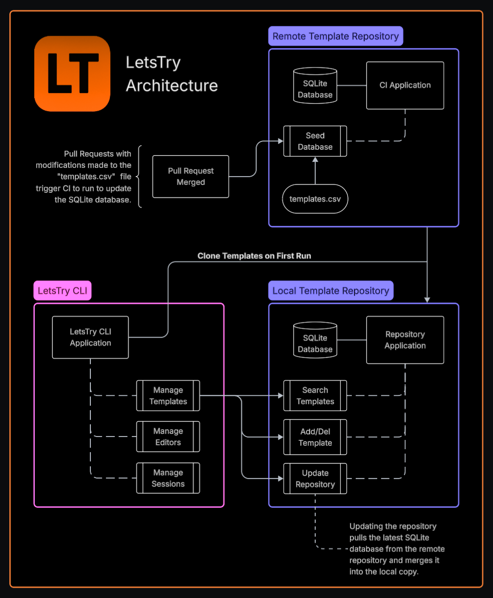

# letstry templates

This repository contains publicly available templates for use with [LetsTry](https://github.com/letstrygo/letstry).

## Adding your template

To add a template to this repository:

1. Fork this repository.
2. Edit the `./dist/repository.csv` file in your fork, adding your template.
3. Create a Pull Request.

## How this repository works

